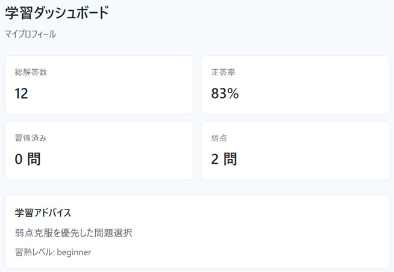
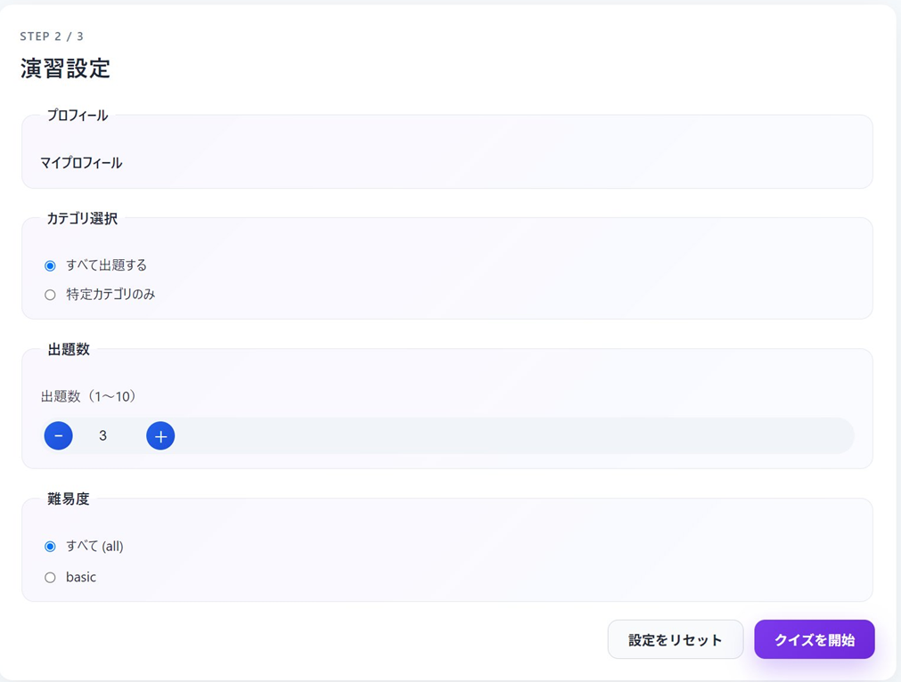
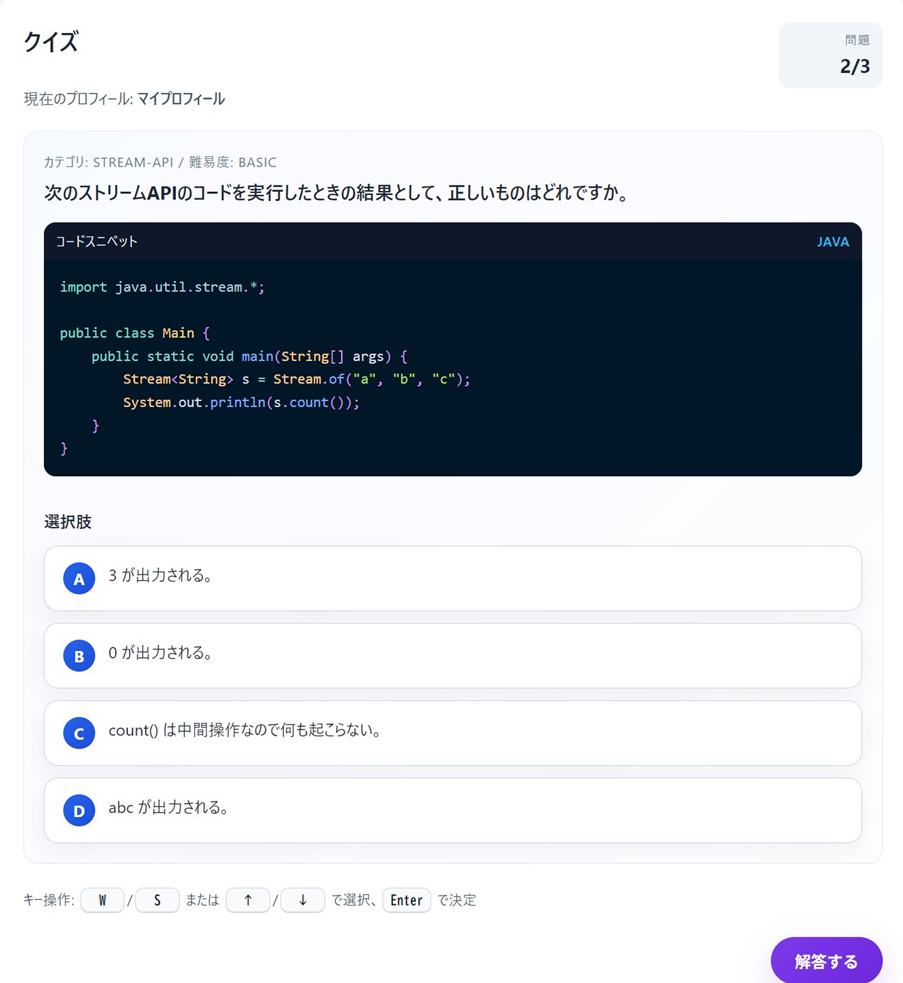
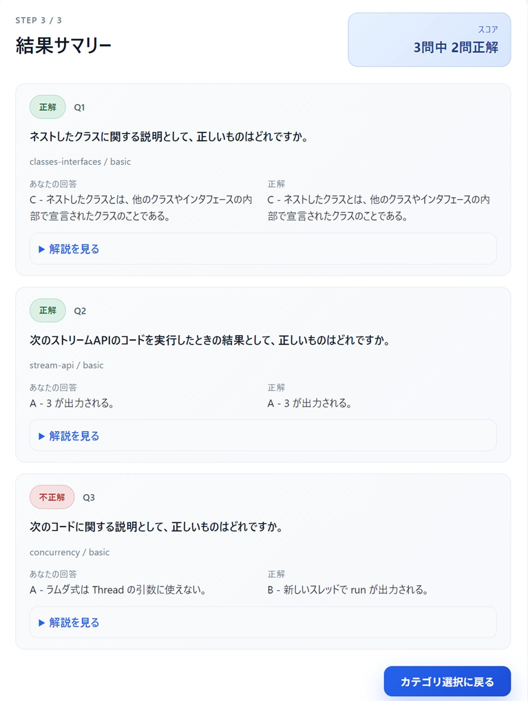

# 百錬剛チャレンジ

Java Gold学習をサポートするWindows向け学習アプリです。

問題演習、学習状況の確認、カテゴリ管理、問題の取り込みなどを使って、試験対策を継続しやすくすることを目的にしています。

## ダウンロード

最新版はGitHub Releasesからダウンロードできます。

> https://github.com/yuukara/hyakuren-challenge-release/releases

ダウンロードするファイル:

```text
hyakuren-challenge-0.1.0-win-x64.exe
```

## 対応環境

- Windows 10 / Windows 11
- 64bit環境

## インストール方法

1. GitHub Releasesから最新版のexeをダウンロードします。
2. ダウンロードしたexeを実行します。
3. 画面の案内に従ってインストールします。

初回起動時やインストール時に、Windowsから「不明な発行元」などの警告が表示される場合があります。これはコード署名証明書を付けていない個人開発アプリでよく起きる表示です。

## スクリーンショット

> TODO: Publicリポジトリに画像を配置した後、パスを確認してください。

### 学習ダッシュボード



### 演習設定



### クイズ画面



### 結果サマリー



## 利用ガイド

詳しい使い方は利用ガイドを確認してください。

> TODO: PublicリポジトリにPDFを置く場合はリンクを確認  
> [百錬剛チャレンジ 利用ガイド](百錬剛チャレンジ_利用ガイド_新版.pdf)

## アンケート

改善のため、利用後アンケートへの回答をお願いします。

> TODO: Googleフォーム作成後にURLを差し替え  
> https://forms.gle/XXXXXXXXXXXX

## 更新履歴

### v0.1.0

- 初回公開版
- Windows向けインストーラーを配布

## 注意事項

- 本アプリは個人開発の学習支援ツールです。
- 収録内容や解説について、誤りを見つけた場合はアンケートから連絡してください。
- 再配布や商用利用については、公開時のライセンス方針に従ってください。
